# feat: Add durable live session recovery

## Overview

Impeccable live mode should remain recoverable when the browser changes live-session state while the agent is not actively polling, after the agent is interrupted, or after the helper server/page reloads. The change adds a durable live-session journal, a resumable server/browser state contract, and an agent-facing status command so a fresh agent can reconstruct the active session and continue from the correct next action.

This plan does not change the core source-first live-mode architecture from `docs/adr-live-variant-mode.md`: variants are still written to source, the browser still previews through HMR or `/source`, and the agent still uses long-poll. It makes the state machine durable and inspectable instead of relying on chat memory plus in-process queues.

---

## Problem Frame

The observed failure mode was: the user accepted and tuned a live variant in the browser while the agent was not listening continuously. The browser moved forward, source entered a transitional state, and the agent no longer had authoritative context for what the user had done. Current code already has useful browser `localStorage` resume behavior and server in-memory queues, but neither is sufficient as a recovery source after interruption, server restart, browser cleanup, or missed polling.

The product expectation is stronger: if the user changes live-mode state in the browser, a later agent should be able to ask, “what happened and what do I need to do next?” and receive a complete, durable answer.

---

## Requirements Trace

- R1. Browser live-session changes are durably recorded outside browser memory and chat context.
- R2. A new or interrupted agent can reconstruct the current live session, selected variant, parameter values, source file, and next required action.
- R3. Accept/discard events are not silently lost when the agent is not polling or when the helper server restarts.
- R4. Browser resume behavior treats source markers and durable session state as recoverable truth rather than hiding unfinished work behind a local handled flag.
- R5. Durable replay is idempotent: duplicate, late, or conflicting events must not corrupt source.
- R6. Carbonize-required accepts are represented as an explicit incomplete state until cleanup is done, and can reconcile to complete when source markers prove cleanup already happened.
- R7. Existing browser/agent event transport remains self-contained, zero-dependency, token-protected, and compatible with the current SSE plus long-poll protocol. Status/resume may be implemented as a separate CLI/file-reader API.
- R8. Agent delivery uses an explicit lease/ack model so a poll response is not treated as completed work until the agent reports a result.
- R9. Annotated screenshots and generated-file fallback metadata remain recoverable while a session is incomplete.

---

## Scope Boundaries

- This plan does not replace long-poll with WebSockets or a harness-specific integration.
- This plan does not make accept fully atomic in one step. It records and resumes the incomplete state first; a later plan may remove carbonize as a manual cleanup stage.
- This plan does not redesign generated variant quality or CSS specificity behavior, except where preview state metadata needs to be captured.
- This plan does not introduce a database or external service. Durable state should live in project-local files managed by the helper server.
- This plan does not support multiple simultaneous browser tabs editing different sessions as a first-class collaboration mode. It should avoid corrupting them, but single active session remains the baseline.

### Deferred to Follow-Up Work

- Atomic accept/carbonize: a later plan can make `live-accept.mjs` produce permanent clean source in one deterministic step.
- Safer generated-preview layout defaults: a later plan can harden wrapper sizing, overflow, and scoped selector guidance.
- Multi-user or multi-tab collaboration semantics: out of scope until live mode intentionally supports collaborative sessions.

---

## Context & Research

### Relevant Code and Patterns

- `skill/scripts/live-server.mjs` owns `/events`, `/poll`, `/source`, `/health`, token validation, in-memory `pendingEvents`, and browser SSE clients.
- `skill/scripts/live-browser.js` owns picker state, variant cycling, parameter controls, `localStorage` session resume, handled-session sentinels, and accept/discard browser behavior.
- `skill/scripts/live-poll.mjs` is the agent-facing poll client and auto-runs `live-accept.mjs` for accept/discard events.
- `skill/scripts/live-accept.mjs` deterministically accepts/discards variant wrappers and can emit carbonize-required results.
- `skill/scripts/live-wrap.mjs` creates source markers and original/variant wrapper structure.
- `tests/live-server.test.mjs`, `tests/live-accept.test.mjs`, `tests/live-wrap.test.mjs`, and `tests/live-e2e.test.mjs` are the relevant verification surfaces.
- `docs/adr-live-variant-mode.md` documents the current architecture and should be updated if the durable journal changes the lifecycle contract.

### Institutional Learnings

- `docs/adr-live-variant-mode.md` explicitly values source modification over DOM patching, zero-dependency scripts, SSE plus fetch, long-poll for agent compatibility, and `display: contents` wrappers.
- `skill/reference/live.md` currently encodes the operational assumption that the agent continuously polls and performs carbonize cleanup before the next poll.

### External References

- External research skipped. This is a repo-owned local protocol and the existing architecture is well documented; local patterns are more authoritative than generic event-sourcing guidance.

---

## Key Technical Decisions

- Add a project-local durable live-session store rather than relying on browser `localStorage` or server memory alone: this is the minimum change that lets any future agent reconstruct state.
- Use append-only session events plus a compact session snapshot: append-only events preserve the audit trail for recovery; the snapshot makes status reads fast and simple. The append-only journal and source markers are canonical; snapshots are rebuildable caches.
- Treat poll delivery as a leased work item, not queue removal: an event becomes terminal only after the agent posts a result/ack, and stale leases are redelivered idempotently.
- Keep browser `localStorage` as a UI convenience, not the source of truth: source markers plus durable server journal should win when they disagree.
- Add explicit server-side session states instead of ad hoc flags: states make accept/discard replay, stale checkpoint rejection, and invalid transitions enforceable.
- Make accept/discard delivery acknowledged before the browser clears recoverable state: this prevents “browser thinks handled, source did not change” split-brain.
- Add agent-facing status/resume scripts instead of requiring agents to inspect raw files: live mode needs a stable agent API, not folklore.

---

## Open Questions

### Resolved During Planning

- Should the first fix be durable resumability or atomic accept? Durable resumability comes first because it solves missed polling, interrupted agents, and transitional source states without requiring a full accept rewrite.
- Should durability depend on external storage? No. Live mode is intentionally self-contained and should use project-local files.

### Deferred to Implementation

- Exact file naming inside the session store: implementation should choose a simple structure after reviewing how `.impeccable-live.json` is currently managed.
- Exact retention policy defaults: implementation should start conservative and prune old completed sessions only after tests cover recovery.
- Exact browser UI copy for pending accept/reconnect states: copy should be short and can be refined during implementation.
- Exact helper-server restart UX: auto-rebind across token/port rotation is out of scope for this plan unless implementation discovers a safe lightweight path. The default recovery is `live-status` plus asking the user to reload/reopen the instrumented page when needed.

---

## Output Structure

    skill/scripts/
      live-session-store.mjs
      live-status.mjs
      live-resume.mjs
      live-server.mjs
      live-browser.js
      live-poll.mjs
      live-accept.mjs
    tests/
      live-session-store.test.mjs
      live-server.test.mjs
      live-browser-recovery.test.mjs
      live-poll.test.mjs
      live-status.test.mjs
      live-e2e.test.mjs
    package.json
    docs/
      adr-live-variant-mode.md

---

## High-Level Technical Design

> *This illustrates the intended approach and is directional guidance for review, not implementation specification. The implementing agent should treat it as context, not code to reproduce.*

```mermaid
stateDiagram-v2
  [*] --> configuring
  configuring --> generating: browser Go
  generating --> source_wrapped: agent wrapped source; file known
  source_wrapped --> variants_written: agent wrote variants
  variants_written --> cycling: agent replies done or browser sees wrapper
  cycling --> accept_pending: browser Accept
  cycling --> discard_pending: browser Discard
  accept_pending --> accepted_source_pending: agent/live-accept wrote accepted variant with carbonize markers
  accepted_source_pending --> complete: carbonize cleanup done
  discard_pending --> complete: source restored
  generating --> stranded: server/page/agent interruption
  cycling --> stranded: server/page/agent interruption
  accept_pending --> stranded: server/page/agent interruption
  stranded --> generating: resume pending leased event
  stranded --> source_wrapped: resume wrapper/original-only source
  stranded --> cycling: resume from durable journal + source markers
  stranded --> accepted_source_pending: resume from carbonize markers
```



```mermaid
sequenceDiagram
  participant B as Browser
  participant S as Live server
  participant J as Session journal
  participant A as Agent
  participant F as Source files

  B->>S: POST /events accept_intent(session, variant, params)
  S->>J: append event; rebuild/atomically update snapshot(accept_pending)
  S-->>B: 202 accepted + durable sequence
  A->>S: GET /poll or live-status
  S->>J: lease next pending event
  S-->>A: accept event + recovery context + lease id
  A->>F: live-accept / cleanup
  A->>S: POST /poll done + file/result + lease id
  S->>J: append agent_result; mark lease acked; update snapshot
  S-->>B: SSE done/committed
  B->>B: clear local pending state only after committed
```

---

## Implementation Units

- U1. **Define durable session store**

**Goal:** Add a small storage module that can append events, update snapshots, read active sessions, and recover pending work after process restart.

**Requirements:** R1, R2, R3, R5, R7, R8, R9

**Dependencies:** None

**Files:**
- Create: `skill/scripts/live-session-store.mjs`
- Create: `tests/live-session-store.test.mjs`
- Modify: `skill/scripts/live-server.mjs`
- Modify: `package.json`

**Approach:**
- Store state under a project-local live directory, separate from `.impeccable-live.json` but discoverable from the same project root.
- Write append-only JSONL events per session and a compact JSON snapshot per session. The JSONL journal is authoritative; snapshots are derived and must be rebuildable when missing, stale, or contradictory.
- Include session id, event sequence, event type, phase, source file when known, visible variant, param values, timestamps, delivery lease/ack metadata, checkpoint revision, generated-file fallback mode, and annotation artifact paths.
- Persist annotation screenshot assets for incomplete sessions when generate events include annotations; status should report missing artifacts as diagnostics.
- Keep the module dependency-free and synchronous or simple async Node filesystem code consistent with current scripts.
- Route browser checkpoints through `/events` as a first-class `checkpoint` event type, with monotonic client revision and session owner metadata.
- Wire new non-E2E tests into the default test script, because `package.json` enumerates test files explicitly rather than globbing all `tests/*.test.mjs`.
- Treat malformed journal entries as recoverable diagnostics rather than crashing the helper server when possible.

**Execution note:** Start test-first for the storage module because it is the new source of truth.

**Technical design:** Directional event shape:

```text
SessionSnapshot = {
  id,
  phase,
  pageUrl,
  sourceFile,
  expectedVariants,
  arrivedVariants,
  visibleVariant,
  paramValues,
  pendingEventSeq,
  deliveryLease,
  checkpointRevision,
  activeOwner,
  sourceMarkers,
  fallbackMode,
  annotationArtifacts,
  diagnostics,
  updatedAt
}
```

**Patterns to follow:**
- `skill/scripts/live-server.mjs` for project-root PID file handling.
- `tests/live-server.test.mjs` for temp-directory test isolation.

**Test scenarios:**
- Happy path: appending `generate`, `variants_ready`, and `accept_intent` events for one session yields a snapshot with the latest phase and selected variant.
- Happy path: reading active sessions after constructing a new store instance returns the session written by the previous store instance.
- Edge case: duplicate event id or sequence is idempotent and does not append conflicting state twice.
- Edge case: a completed session remains readable for audit but is not returned as the active session by default.
- Edge case: journal and snapshot disagree after a simulated crash; status rebuilds the snapshot from the journal and records a repair diagnostic.
- Edge case: annotated generate event keeps its screenshot artifact available until the session completes.
- Error path: corrupted JSONL line is reported in diagnostics while valid prior events still reconstruct the snapshot.
- Error path: storage directory creation failure returns a structured error to the caller.

**Verification:**
- Durable state survives module re-instantiation and can answer “what is the active session and next action?” without browser or server memory.

---

- U2. **Journal browser events and enforce session transitions**

**Goal:** Make `/events` persist generate/accept/discard and checkpoint events before they are exposed to agent polling.

**Requirements:** R1, R3, R5, R7, R8

**Dependencies:** U1

**Files:**
- Modify: `skill/scripts/live-server.mjs`
- Modify: `tests/live-server.test.mjs`

**Approach:**
- On `POST /events`, validate generate/accept/discard/checkpoint events, assign or validate a durable event sequence, append to the session journal, then enqueue actionable events for polling. Checkpoints update durable state but do not necessarily create agent work.
- Add a server-side session state machine that accepts valid transitions and treats duplicate valid events idempotently.
- Add an at-least-once poll delivery model: pending events are leased to a poll response, redelivered after lease expiry, and marked complete only when the agent posts a matching result.
- Keep `exit` as lower priority than real session events so queued generate/accept/discard work is not masked by tab disconnect.
- Preserve current token validation and in-memory fast path, but make disk the replayable source.
- On server startup, rebuild pending work from the journal into the in-memory queue. `/poll` may consult the store when memory is empty, but the journal remains canonical.

**Patterns to follow:**
- Existing `validateEvent()` and `enqueueEvent()` in `skill/scripts/live-server.mjs`.
- Existing `/events` and `/poll` tests in `tests/live-server.test.mjs`.

**Test scenarios:**
- Happy path: `POST /events` for generate persists an event before a poll consumes it.
- Happy path: if the server object is recreated with the same project store, `/poll` returns the previously unconsumed generate event.
- Edge case: duplicate accept for the same session and variant returns the same durable state without creating conflicting queue entries.
- Edge case: discard after accept-pending is rejected or ignored according to the state machine and returns a diagnostic response.
- Error path: invalid transition returns a clear JSON error and does not append to the journal.
- Integration: queued real events are delivered before synthetic `exit` events.
- Integration: event delivered to a poll but never acked is redelivered after lease timeout and remains idempotent when eventually completed.

**Verification:**
- Browser events are not lost by an idle agent or helper server restart as long as the project-local journal remains.

---

- U3. **Add browser checkpoints and acknowledged accept/discard**

**Goal:** Have the browser record current live state durably and stop clearing recoverable local state until the server acknowledges the state change.

**Requirements:** R1, R2, R3, R4, R5

**Dependencies:** U1, U2

**Files:**
- Modify: `skill/scripts/live-browser.js`
- Modify: `tests/live-e2e.test.mjs`
- Create: `tests/live-browser-recovery.test.mjs`

**Approach:**
- Add a browser checkpoint helper that sends current session state to `/events` as `type: "checkpoint"` whenever variant, parameter values, phase, or selected source file context changes.
- Include monotonic client revisions and an active-session owner/epoch so stale checkpoints from old tabs cannot regress a newer accepted/discarded phase.
- Change accept/discard from fire-and-forget to acknowledged durable receipt before `markSessionHandled()` and before local session cleanup. Agent completion remains a later state.
- Keep a local pending state if acknowledgement fails, with a visible “waiting for agent/server” or “reconnect to recover” state instead of silently resetting.
- Preserve existing `localStorage` resume as a UI fast path, but do not let its single handled key suppress recovery when source markers or durable server state indicate pending work.
- Capture current parameter values on every change, not only at accept time, so resume can reconstruct user tuning even before Accept.

**Patterns to follow:**
- Existing `saveSession()`, `resumeSession()`, `paramsCurrentValues`, and `handleAccept()` in `skill/scripts/live-browser.js`.
- Existing scroll restoration and MutationObserver recovery patterns in `skill/scripts/live-browser.js`.

**Test scenarios:**
- Happy path: moving a parameter slider sends a checkpoint with updated param values and does not reset the tune panel.
- Happy path: clicking Accept receives server acknowledgement, then transitions the browser to confirmed/pending-agent state.
- Edge case: Accept POST fails due to server down; browser keeps session recoverable and shows a reconnect/retry state.
- Edge case: page reload after accept acknowledgement but before agent completion resumes as pending cleanup rather than picking mode.
- Edge case: local handled flag exists but source wrapper still exists; browser resumes or reports pending cleanup instead of hiding the session.
- Edge case: stale checkpoint from a background tab arrives after accept-pending; server rejects it or records it as stale without changing snapshot phase.
- Integration: after HMR inserts variants, browser checkpoint records arrived variant count and visible variant.

**Verification:**
- The browser never becomes the only place where selected variant and tune values exist.

---

- U4. **Expose agent status and resume commands**

**Goal:** Give agents a stable CLI/API to inspect and continue live state without manually reading raw journal files or source markers.

**Requirements:** R2, R4, R6, R7

**Dependencies:** U1, U2

**Files:**
- Create: `skill/scripts/live-status.mjs`
- Create: `skill/scripts/live-resume.mjs`
- Create: `skill/scripts/live-complete.mjs`
- Modify: `skill/scripts/live-server.mjs`
- Modify: `skill/reference/live.md`
- Modify: `tests/live-server.test.mjs`
- Create: `tests/live-status.test.mjs`

**Approach:**
- Add a status endpoint or direct store reader that returns active session snapshots, pending events, source marker status, and recommended next action.
- Add `live-status.mjs` for human/agent-readable JSON status.
- Add `live-resume.mjs` if the status command should also requeue pending events or print a normalized next event for the agent.
- Include source-marker scanning for `impeccable-variants-start`, `impeccable-carbonize-start`, and `impeccable-param-values` so source truth can repair journal/browser drift. The scan domain should include resolved live config targets, journal-known files, and existing source roots used by marker helpers; generated/served files covered by live config must be diagnosable.
- Consult the generated-file guard before recommending deterministic `live-accept`; generated/served-file fallback sessions should return `persist_fallback_to_true_source`.
- Distinguish generate recovery phases: pending event only, wrapper/original-only source, variants partially/fully written, and browser not yet confirmed cycling.
- Keep output JSON stable and agent-readable: explicit `nextAction`, `reason`, `file`, `sessionId`, `paramValues`, `lease`, and `diagnostics` fields.
- After completion acknowledgement, completed sessions return `no_active_session` by default unless an include-completed flag is requested.

**Technical design:** Directional `nextAction` values:

```text
poll_for_pending_event
write_variants
continue_writing_variants
run_accept_cleanup
run_carbonize_cleanup
acknowledge_completion
persist_fallback_to_true_source
restore_discard
ask_user_to_reopen_browser
no_active_session
```

**Patterns to follow:**
- `skill/scripts/live-poll.mjs` for CLI JSON output style.
- `skill/scripts/live-accept.mjs` marker parsing helpers where reusable.

**Test scenarios:**
- Happy path: status with a pending accept event returns `run_accept_cleanup` and includes variant id and param values.
- Happy path: status with carbonize markers in source returns `run_carbonize_cleanup` even if no browser is connected.
- Edge case: status with no active journal but source variant markers returns a recoverable source-marker session.
- Edge case: status with stale completed sessions returns `no_active_session` by default and can include completed sessions only when requested.
- Edge case: source markers exist in a generated/served file covered by live config; status recommends fallback true-source persistence rather than deterministic accept.
- Edge case: wrapper exists with only original content; status recommends continuing variant writing rather than accept cleanup.
- Error path: missing or unreadable source file appears as a structured diagnostic, not an unhandled exception.
- Integration: `live-resume.mjs` can requeue or emit the pending event after a helper server restart.

**Verification:**
- A fresh agent can run one command and know exactly what happened in live mode and what to do next.

---

- U5. **Make poll/accept acknowledge durable completion**

**Goal:** Ensure agent-side handling updates durable session state after source writes and carbonize cleanup so browser and future agents know whether the session is complete.

**Requirements:** R2, R5, R6

**Dependencies:** U1, U2, U4

**Files:**
- Modify: `skill/scripts/live-poll.mjs`
- Modify: `skill/scripts/live-accept.mjs`
- Modify: `skill/scripts/live-server.mjs`
- Modify: `tests/live-accept.test.mjs`
- Modify: `tests/live-server.test.mjs`
- Create: `tests/live-poll.test.mjs`

**Approach:**
- Have `live-poll.mjs` report auto-accept/discard results back to the server/session store, not only print `_acceptResult` to stdout.
- Complete the delivery lease only after this result is durably recorded; failed source writes should release or mark the lease recoverable with diagnostics.
- Represent `carbonize: true` as `accepted_source_pending` until cleanup is confirmed.
- Add `live-complete.mjs` as the canonical completion acknowledgement path after carbonize cleanup. `live-status.mjs` reports that completion is needed; `live-resume.mjs` helps recover pending work; only `live-complete.mjs` marks carbonize cleanup complete.
- Reconcile lost completion acknowledgements from source truth: if carbonize markers are gone and accepted content is materialized, status can idempotently record a synthetic completion event.
- Make duplicate completion acknowledgements idempotent.
- Preserve the stderr warning as a human attention signal, but do not rely on warning text as the state machine.

**Patterns to follow:**
- Current `_acceptResult` attachment in `skill/scripts/live-poll.mjs`.
- Current carbonize marker output in `skill/scripts/live-accept.mjs`.

**Test scenarios:**
- Happy path: accept event processed by `live-poll.mjs` updates durable session to `accepted_source_pending` when carbonize is required.
- Happy path: discard event processed by `live-poll.mjs` updates durable session to complete.
- Happy path: a `live-poll.mjs` CLI/integration test processes an accept event and records the durable lease/result acknowledgement through the real poll script path.
- Edge case: running accept twice for the same event returns the same final durable phase without rewriting source twice.
- Error path: `live-accept.mjs` failure records an agent error in the session journal and leaves next action recoverable.
- Integration: browser reload after agent accept but before carbonize can be diagnosed by `live-status.mjs`.
- Integration: completion acknowledgement is lost after source cleanup; status detects the condition and recommends `acknowledge_completion`, then `live-complete.mjs` resolves the session complete.

**Verification:**
- Durable state reflects what happened to source, not only what browser requested.

---

- U6. **Update live-mode guidance and recovery UX**

**Goal:** Teach both agents and users the new recovery contract and make recovery visible in live mode.

**Requirements:** R2, R4, R6, R7

**Dependencies:** U3, U4, U5

**Files:**
- Modify: `skill/reference/live.md`
- Modify: `docs/adr-live-variant-mode.md`
- Modify: `skill/scripts/live-browser.js`
- Modify: `README.md` if live command usage is documented there

**Approach:**
- Update `reference/live.md` to start with a status check when resuming a session or when the agent suspects it missed events.
- Document the durable journal and session states in the ADR.
- Add concise browser states for pending accept, reconnect/recover, and agent cleanup pending.
- Keep chat overhead low: the agent should use status JSON instead of asking the user to describe browser state.

**Patterns to follow:**
- Existing `reference/live.md` contract sections for poll loop, accept, carbonize, and cleanup.
- Existing toast and bar state patterns in `skill/scripts/live-browser.js`.

**Test scenarios:**
- Test expectation: mostly documentation and UX copy. Behavioral coverage belongs to U3-U5; this unit should be verified through review plus any snapshot/E2E assertions added for visible pending states.

**Verification:**
- A new agent reading `reference/live.md` knows to recover state before making assumptions after interruption.

---

- U7. **Add restart and interruption E2E coverage**

**Goal:** Prove the durable recovery contract in realistic browser/server/agent flows.

**Requirements:** R1, R2, R3, R4, R5, R6

**Dependencies:** U1, U2, U3, U4, U5

**Files:**
- Modify: `tests/live-e2e.test.mjs`
- Modify: `tests/framework-fixtures/README.md` if new fixture expectations are needed
- Modify: `tests/live-e2e/agent.mjs` if deterministic agent hooks need to simulate interruption

**Approach:**
- Add focused E2E cases for missed polling, helper server restart, browser reload, accept before agent resumes, and carbonize-pending status.
- Prefer one or two compact fixtures over broad matrix explosion.
- Keep deterministic fake agent path as the primary verification route; LLM agent remains opt-in.

**Patterns to follow:**
- Existing live-mode E2E setup in `tests/live-e2e.test.mjs`.
- Fixture authoring guidance in `tests/framework-fixtures/README.md`.

**Test scenarios:**
- Integration: user clicks Go while no poll is active; later poll receives durable generate event and completes variants.
- Integration: user changes Tune values, reloads browser, and status/resume reports the same values.
- Integration: user clicks Accept, agent is interrupted, new agent runs status and sees `run_accept_cleanup` with variant id and params.
- Integration: helper server restarts after queued generate; resumed server can still surface the pending event.
- Integration: agent receives a poll event through the real `live-poll.mjs` path and then crashes before posting result; a resumed poll redelivers the leased event after timeout.
- Integration: source contains carbonize markers; status returns cleanup pending even without an active browser tab.
- Integration: out-of-order checkpoint after accept does not regress pending accept state.
- Error path: duplicate accept and late discard do not corrupt final source.

**Verification:**
- E2E coverage demonstrates recovery from the exact “agent was not listening” failure mode.

---

## System-Wide Impact

- **Interaction graph:** Browser `live-browser.js` posts events/checkpoints to `live-server.mjs`; server persists them through `live-session-store.mjs`; agent observes them through `live-poll.mjs`, `live-status.mjs`, or `live-resume.mjs`; source mutations still happen through `live-wrap.mjs` and `live-accept.mjs`.
- **Error propagation:** Failed event persistence must be visible to the browser before it clears state. Failed source cleanup must be visible in status output and kept recoverable.
- **State lifecycle risks:** The key risk is split-brain among browser localStorage, server journal, in-memory queue, snapshots, and source markers. The plan makes source markers plus durable journal canonical, snapshots rebuildable, in-memory queues cache-only, and browser localStorage only an optimization.
- **API surface parity:** The new status/resume scripts become agent-facing APIs and should be reflected in `reference/live.md` and tests.
- **Integration coverage:** Unit tests alone will not prove recovery. E2E must cover browser reload, server restart, missed poll, duplicate events, and carbonize pending states.
- **Unchanged invariants:** Live mode remains source-first, self-contained, zero-dependency, token-protected, and transport-compatible with current AI harnesses.

---

## Risks & Dependencies

| Risk | Mitigation |
|------|------------|
| Durable journal becomes another state source that can drift | Make source markers plus journal reconciliation explicit in `live-status.mjs`; keep browser localStorage advisory. |
| Event replay causes duplicate source rewrites | Add idempotency keys, state-machine validation, leased delivery, and tests for duplicate accept/discard. |
| Browser waits forever after accept if agent is absent | Show explicit pending/reconnect state and provide status/resume command for the agent. |
| Poll delivery is mistaken for completion | Model leased delivery separately from completion acknowledgement and redeliver expired leases. |
| Snapshot contradicts journal after crash | Treat journal as canonical and rebuild/repair snapshots on startup/status reads. |
| Annotated screenshot path goes stale before recovery | Store annotation artifacts with the incomplete session and retain them until completion cleanup. |
| Disk writes fail in restricted environments | Return structured server errors and do not clear browser state until persistence succeeds. |
| Tests become slow or brittle | Keep most coverage in store/server tests and add only targeted E2E cases for true cross-process recovery. |
| Backward compatibility with existing installed skill output drifts | Update source skill files first, then run the project build to regenerate provider outputs in a separate execution phase. |

---

## Documentation / Operational Notes

- Update `docs/adr-live-variant-mode.md` because durability changes the architecture from memory queue plus localStorage to journaled sessions.
- Update `skill/reference/live.md` so agents know to run status/resume after interruption or before assuming no pending work.
- If generated provider skill outputs are tracked, implementation should regenerate them with the existing build process after changing `skill/`.
- Because the default test script enumerates test files, implementation must update `package.json` when adding new non-E2E test files.
- Consider adding `.impeccable-live/` or the chosen session-store directory to gitignore if it is not already ignored.

---

## Sources & References

- Related architecture: `docs/adr-live-variant-mode.md`
- Live instructions: `skill/reference/live.md`
- Browser live implementation: `skill/scripts/live-browser.js`
- Server transport: `skill/scripts/live-server.mjs`
- Agent poll client: `skill/scripts/live-poll.mjs`
- Accept/discard source cleanup: `skill/scripts/live-accept.mjs`
- Live-mode tests: `tests/live-server.test.mjs`, `tests/live-accept.test.mjs`, `tests/live-e2e.test.mjs`

---

## Surgical Overhaul Follow-Ups (2026-04-29)

- Dependency audit is now Bun-native via `bun run audit`, but the gate currently fails on transitive advisories:
  - `archiver -> archiver-utils -> lodash` and `brace-expansion`
  - optional `puppeteer -> @puppeteer/browsers -> basic-ftp`
- Decision: keep the audit script honest and failing instead of adding ignores before exploitability and replacement cost are reviewed.
- Recommended next dependency work: evaluate whether release ZIP creation still needs `archiver`, and whether optional Puppeteer screenshot tooling can be replaced, isolated, or upgraded without bloating install size.
